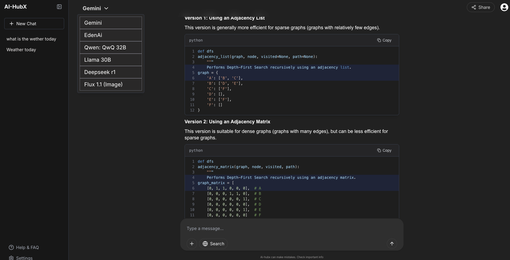

# 🧠 AI-hubX

AI-hubX is a full-stack platform built to help students and teachers access multiple AI models from a single interface — **without login barriers**. It’s designed for ease of use, fast response, and centralized access to a variety of AI tools.

Built using the **MERN stack** and enhanced with **Socket.IO** for real-time interactions, AI-hubX offers a seamless experience for exploring AI capabilities in one unified place.

---

## 🚀 Features

- 🔗 **Multi-AI Integration** – Access several AI models in one place.
- ⚡ **Real-time Communication** – Powered by Socket.IO for fast, two-way communication.
- 🧑‍🏫 **Student & Teacher Friendly** – Tailored to simplify AI access in academic environments.
- 🧩 **Modular Architecture** – Easily extendable with new models and APIs.

---

## 🧰 Tech Stack

### 🖥️ Frontend
- React.js
- Tailwind CSS
- Zustand
- Socket.IO Client

### 🔧 Backend
- Node.js
- Express
- Socket.IO
- bcryptjs
- Cloudinary

### 🗃️ Database
- MongoDB

### 🧩 Others
- JWT
- Docker (for containerization)
- REST APIs (to interact with various AI models)

### 🧠 Integrated AI Models
- DeepSeek AI
- LLama
- EdenAI
- emini-1.5-flash
- mistral-large-latest
- Qwen AI
- vyro.ai (Image Generation)
- Segmind AI

---

## 💻 How to Run Locally

### 1. Clone the Repository

```bash
git clone https://github.com/Ajju0211/AI-HubX
cd AI-HubX
```
### 2. Install Dependencies
```bash
npm run build
```
### 3. Start the app
```bash
# Start the project
npm run start
```
**🌐 Live Demo**

[🔗 LIVE DEMO](https://ai-hub-h4lj6qtmj-ajju0211s-projects.vercel.app/)

---

## 👨‍🎓Auther
Built with ❤️ by Ajay Singh


